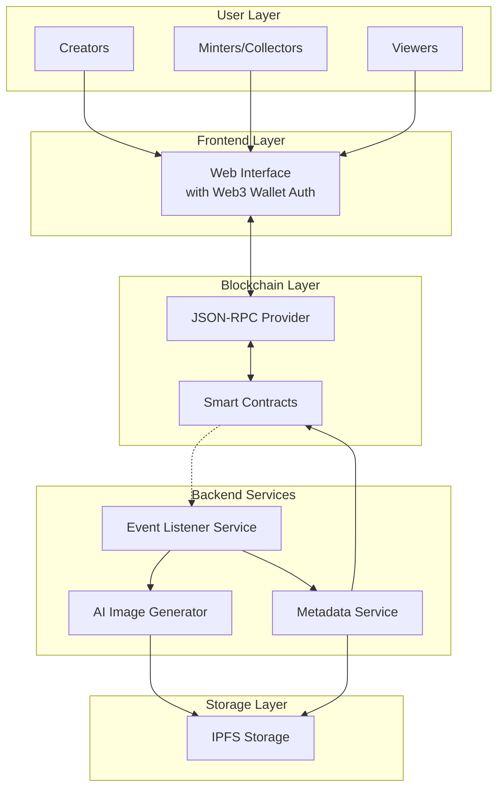
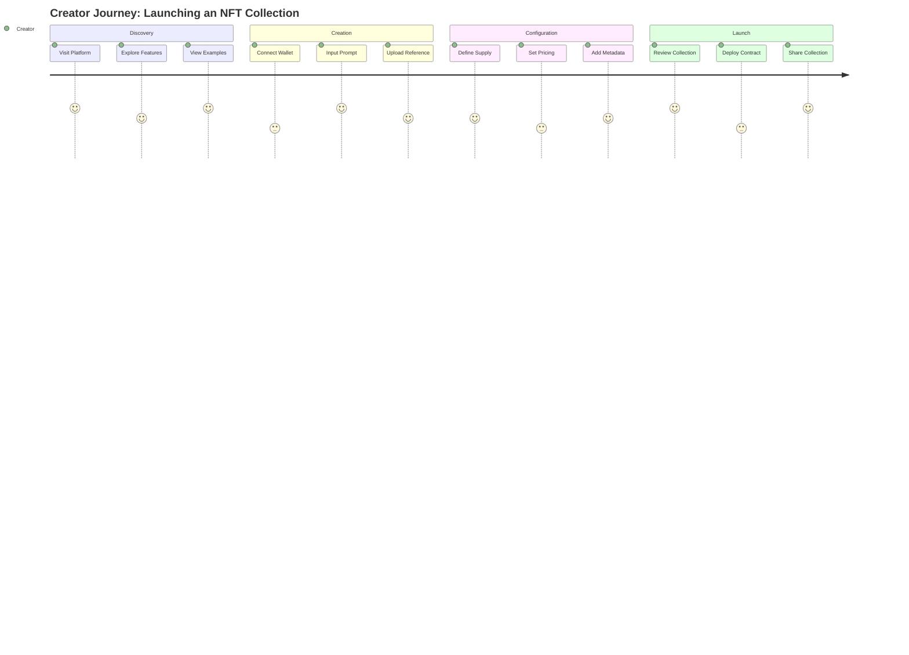
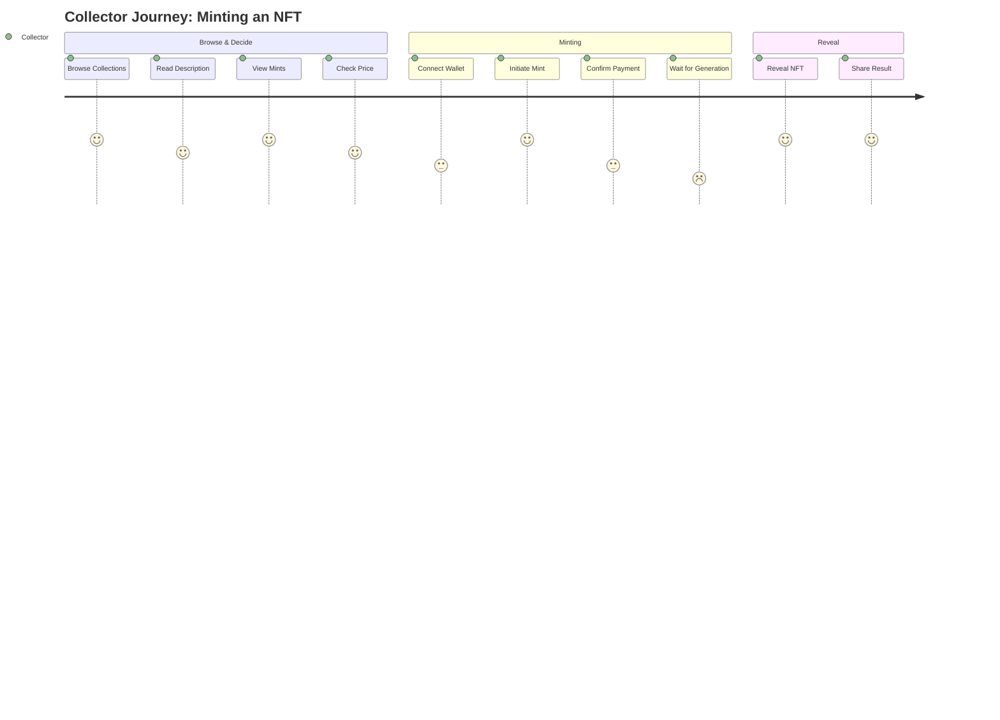
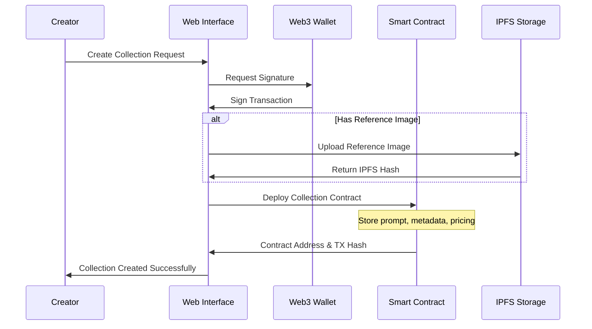
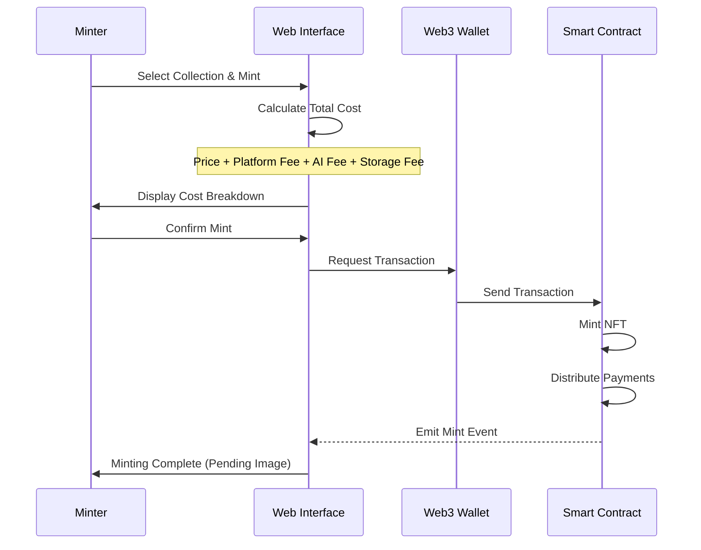
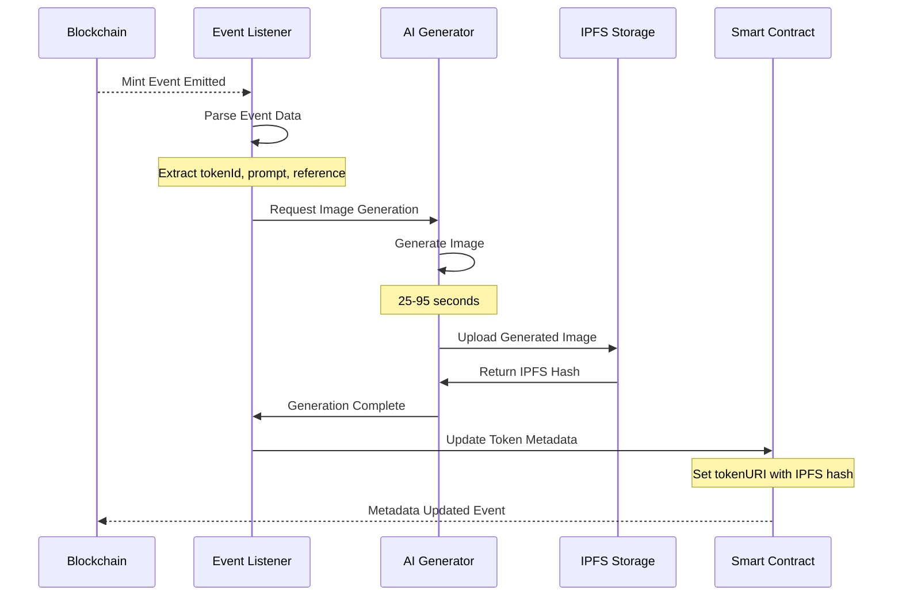
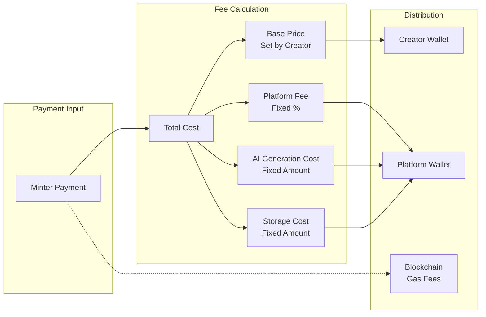
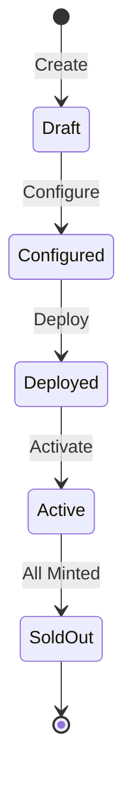
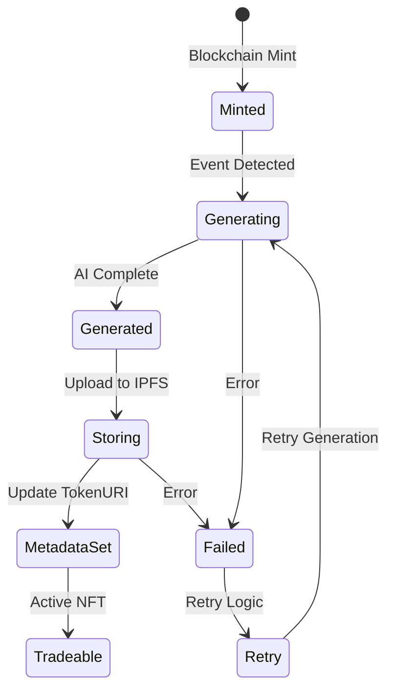
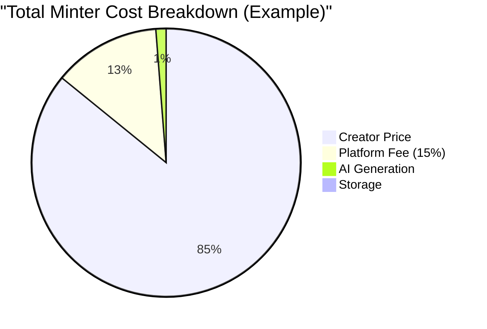

# AI-Powered NFT Launchpad: Project Concept Documentation

## Executive Summary

### Project Vision

A decentralized platform that democratizes NFT creation through AI-powered generation, enabling anyone to launch dynamic NFT collections with text prompts while introducing gamification elements through uncertainty in the minting process.

### Core Innovation

Unlike traditional NFT platforms where artwork is pre-generated, our system generates unique AI artwork at the moment of minting, creating a "mystery box" experience where collectors don't know exactly what they'll receive until after purchase.

### Value Propositions

- **For Creators**: Zero upfront costs, no technical barriers, AI-assisted creativity
- **For Collectors**: Gamified minting experience, guaranteed uniqueness, dynamic pricing discovery
- **For the Ecosystem**: Sustainable economics, reduced speculation, increased utility focus

## System Architecture Overview



## Core Components

### 1. Collection Management System

**Purpose**: Handles the creation, configuration, and lifecycle of NFT collections.

**Key Features**:

- Collection template creation with AI prompts
- Reference image attachment and management (optional)
- Pricing and royalty configuration
- Collection metadata management
- Smart contract-based access control

### 2. AI Generation Engine

**Purpose**: Manages the AI-powered image generation pipeline.

**Key Features**:

- Prompt parsing from blockchain events
- Reference image integration
- Failure handling and retry logic
- Direct IPFS upload after generation

### 3. Mint Management System

**Purpose**: Orchestrates the NFT minting process from request to delivery.

**Key Features**:

- Direct blockchain minting
- Payment processing via smart contract
- Metadata generation and storage
- Event-driven image generation trigger

### 4. Payment Distribution System

**Purpose**: Manages the economic flows within the platform.

**Key Features**:

- Multi-party payment splitting
- Fee calculation and collection
- Creator royalty distribution
- Platform fee management

### 5. Event Listener Service

**Purpose**: Monitors blockchain events and triggers off-chain actions.

**Key Features**:

- Real-time event monitoring
- Mint event detection
- AI generation triggering
- Metadata update orchestration
- IPFS upload management

## User Stories

### Creator Journey



### Collector Journey



### User Personas

1. **Creative Creator Clara**

   - Non-technical artist wanting to experiment with AI
   - Needs: Simple interface, creative control, fair monetization
   - Pain points: High platform fees, technical complexity

2. **Minter Mike**

   - NFT collector seeking unique pieces
   - Needs: Fair pricing, transparency, exciting reveals
   - Pain points: Rug pulls, overpriced mints, low quality art

3. **Speculator Sarah**
   - Trader looking for profit opportunities
   - Needs: Rarity data, market analytics, quick flips
   - Pain points: Illiquid markets, unclear valuations

## Data Flow Diagrams

### Collection Creation Flow



### NFT Minting Flow



### Image Generation Flow (Backend Service)



### Payment Distribution Flow



## State Management

### Collection States



### NFT States



## Economic Model

### Fee Structure

The platform implements a transparent fee structure where all costs are added on top of the creator's base price:



**Fee Calculation Formula:**

```
Total Minter Cost = Creator Price + (Creator Price × Platform Fee %) + AI Fee + Storage Fee
Creator Receives = Creator Price (100%)
Platform Receives = Platform Fee + AI Fee + Storage Fee
```

**Example:**

- Creator sets price: 10 USDC
- Platform fee (15%): 1.5 USDC
- AI generation fee: 1 USDC
- Storage fee: 0.5 USDC
- **Total minter pays: 13 USDC**
- **Creator receives: 10 USDC**
- **Platform receives: 3 USDC**

### Revenue Streams

1. **Transaction Fees**

   - Fixed percentage of creator price (e.g., 15%)
   - Applied uniformly to all collections

2. **Service Fees**
   - AI generation fee per mint
   - Storage fee per mint
   - Set in smart contract constructor

## NFT Collection Forking Feature

### Feature Overview

Introduce collection forking capability to the AI-powered NFT launchpad, enabling users to create derivative collections that build upon existing ones while maintaining lineage tracking and implementing revenue sharing mechanisms.

### Business Value

- **Creator Empowerment**: Enable remix culture and collaborative creation
- **Revenue Streams**: Generate ongoing royalties for original creators through fork fees
- **Community Growth**: Foster ecosystem engagement through derivative works
- **Innovation**: Enable prompt evolution and iterative improvement

### Core Forking Functionality

#### Fork Creation Process

- **Eligibility**: Any deployed NFT collection can be forked by any user
- **Fork Inheritance**: Forked collections only inherit the original collection's prompt
- All other properties (name, symbol, reference image, max supply, mint price) are user-configured from scratch

#### Lineage Tracking

- **Parent Reference**: Each fork stores immutable reference to parent collection address
- Lineage traversal handled by factory contract for fee distribution

#### Enhanced Metadata

New collection properties:

```solidity
address public parentCollection;     // Direct parent (address(0) for originals)
```

### Revenue Sharing System

#### Fee Distribution Formula

For each mint in a forked collection, fees are distributed according to diminishing returns:

```
Original Creator: 10% (constant across all fork levels)
Fork Level 1: 5.0%
Fork Level 2: 2.5%
Fork Level 3: 1.25%
Fork Level n: 5% / (2^(n-1))
```

#### Payment Flow

- Fork creator pays same LLM_GENERATION_FEE (0.001 ETH) to factory
- Factory calculates lineage fees and creates appropriate payees/amounts arrays
- Each mint distributes payments according to pre-calculated lineage structure
- Platform fee (2.5%) remains unchanged

#### Fee Calculation Example

Fork Level 2 mint with 100 ETH price:

- Original Creator: 10 ETH (10%)
- First Fork Creator: 5 ETH (5%)
- Current Fork Creator: 82.5 ETH (remaining after fees)
- Platform: 2.5 ETH (2.5%)

### AI Generation Enhancement

#### Prompt Composition

Generator service composes prompts by traversing lineage:

```
Final Prompt = Root Prompt + " " + Fork1 Prompt + " " + Fork2 Prompt + ...
```

#### Reference Image Handling

- Forks can set their own reference image
- If no reference image provided, no inheritance (standard behavior)

#### Generation Pipeline

Enhanced event processing:

1. Detect `TokenMinted` event from any collection (original or fork)
2. If fork detected, traverse lineage to collect all prompts
3. Compose final prompt from root to current fork
4. Generate image using composite prompt and fork's reference image
5. Upload and update metadata as usual

### Smart Contract Changes

#### NFTCollectionFactory.sol Updates

```solidity
// New function
function forkCollection(
    address parentCollectionAddress,
    string memory name,
    string memory symbol,
    string memory prompt,
    string memory referenceImageUrl,
    uint256 maxSupply,
    uint256 mintPrice
) external payable returns (uint256);

// Helper function to calculate lineage fees
function _calculateLineageFees(address parentCollection, uint256 mintPrice)
    private view returns (address payable[] memory, uint256[] memory);

// Helper function to get lineage
function getCollectionLineage(address collection)
    external view returns (address[] memory);
```

#### NFTCollection.sol Updates

```solidity
// Constructor extension - add optional parent parameter
constructor(
    string memory name,
    string memory symbol,
    string memory _prompt,
    string memory _referenceImageUrl,
    uint256 _maxSupply,
    address _creator,
    address _factory,
    address payable[] memory _payees,
    uint256[] memory _amounts,
    address _parentCollection  // New optional parameter
)

// New state variable
address public parentCollection;     // Direct parent (address(0) for originals)
```

### Frontend Integration

#### Collection Browse Page

- "Fork" button on each collection card
- Fork count display (simple counter)

#### Fork Creation Flow

- Standard collection creation wizard (no pre-population)
- Each wizard step displays parent collection info for reference:
  - Parent collection image, name, symbol
  - "Forking from: [Parent Name]" indicator
  - Only show immediate parent (no lineage chain)
- All form fields empty and user-configurable
- Standard prompt input (no composition preview)

#### Collection Detail Page

- Display immediate parent collection (if fork)
- Show if collection has been forked (fork count)
- Simple "Fork this collection" button

### Generator Service Changes

#### Enhanced Event Processing

```javascript
// New functions in generator.js
async processTokenMinted(event) {
  const collection = await this.getCollectionInfo(event.address);

  if (collection.parentCollection !== '0x0000000000000000000000000000000000000000') {
    const lineage = await this.getCollectionLineage(event.address);
    const compositePrompt = await this.composePromptFromLineage(lineage);
    // Generate with composite prompt...
  }
}

async composePromptFromLineage(lineage) {
  // Traverse lineage and concatenate prompts
}
```

#### Prompt Composition Logic

- Fetch prompt from each collection in lineage
- Concatenate with appropriate separators
- Maintain coherent prompt structure for AI generation

### Technical Implementation Plan

#### Phase 1: Smart Contract Implementation

1. Update NFTCollectionFactory.sol with fork functionality
2. Modify NFTCollection.sol constructor for parent collection parameter
3. Implement fee distribution with lineage support in factory
4. Write comprehensive test suite
5. Deploy to testnet

#### Phase 2: Generator Service Updates

1. Enhance blockchain listener for fork events
2. Implement prompt composition logic
3. Add lineage traversal functions
4. Test composite prompt generation

#### Phase 3: Frontend Integration

1. Add fork creation UI to collection pages
2. Update collection creation wizard with parent info display
3. Update collection browse with fork indicators
4. Add simple parent/fork relationship display

## Future Enhancements (Stretch Goals)

### Phase 2 Features

- **Collection Forking**: Enable derivative collections with lineage tracking and revenue sharing
- **Fork Hierarchy Display**: Visual representation of collection lineage trees
- **Advanced Fork Analytics**: Statistics and performance tracking for fork networks
- **Subscription Models**: Creator Pro tiers with advanced features
- **Premium Services**: Custom smart contracts, white-label solutions
- **Secondary Market**: Trading fees and auction house
- **Gamification Mechanics**: Mystery box reveals, rarity distributions
- **Security Enhancements**: Multi-sig deployment, emergency pause
- **Performance Optimization**: Advanced caching, load balancing
- **Analytics Dashboard**: Comprehensive success metrics and KPIs

### Phase 3 Features

- AI video NFT generation
- Cross-chain compatibility
- NFT breeding mechanics
- Prompt marketplace
- Metaverse integration
- Dynamic NFT evolution
- Social features
- DAO governance

### Long-term Vision

- Fully decentralized infrastructure
- AI model marketplace
- Creator collaboration tools
- Enterprise solutions
